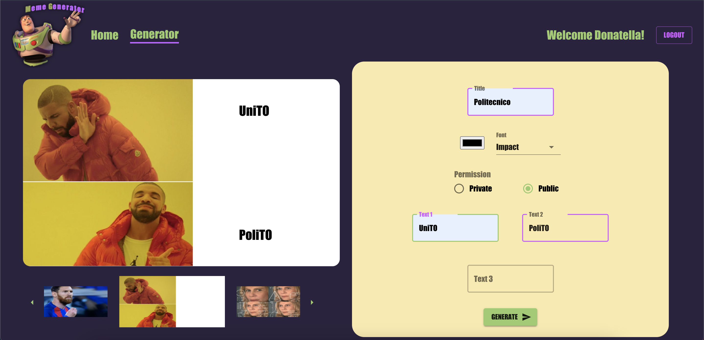

# Exam #2: "Meme Generator"

## Student: s281564 MANCO MARCO

## React Client Application Routes

- Route `/`: Contains the MainContent component, namely a list of the meme (only public if the user is not logged in, all memes otherwise). On the page, the user can see the memes, delete his memes (if logged in) and copy an existing meme (if logged in).
- Route `/generator`: Contains the Generator component. This component is made up by a MemeImg and a FormGenerator component. On the page, the user can create a new meme or she can make a copy of an existing meme.
- Route `/login`: Contains the Login component used to perform the login.
- ...

## API Server

- GET `/api/sessions/current`
  - Response: 200 OK (success) or 401 Unauthenticated user.
  - Response body: User info.
- GET `/api/memes`
  - Request body: None.
  - Require to be logged in, namely a session should be set up.
  - Response: 200 OK (success) or 500 Internal Server Error (generic error).
  - Response body: An array of objects, each describing a meme (all stored memes are sent).
- GET `/api/memes/public`
  - Request body: None.
  - Response: 200 OK (success) or 500 Internal Server Error (generic error).
  - Response body: An array of objects, each describing a public meme.
- GET `/api/imgs/:id`
  - Request body: None.
  - Response: 200 OK (success) or 500 Internal Server Error (generic error).
  - Response body: Image requested.
- GET `/api/info/imgs/:id`
  - Request body: None.
  - Response: 200 OK (success) or 500 Internal Server Error (generic error).
  - Response body: Image info like the id of the image and the positions allowed to write (like left-top, ...).
- GET `/api/info/imgs`
  - Request body: None.
  - Response: 200 OK (success) or 500 Internal Server Error (generic error).
  - Response body: An array of image info like the id of the image and the positions allowed to write (like left-top, ...). Each item describes an image stored in the database.
- GET `/api/fonts`
  - Request body: None.
  - Response: 200 OK (success) or 500 Internal Server Error (generic error).
  - Response body: An array of font with its id font-family and size.
- POST `/api/session`
  - Request body: A JSON that contains a user credentials {username, password}.
  - Response: 200 OK (success) or 401 Error (with info).
  - Response body: User info or error info.
- POST `/api/memes`
  - Request body: A JSON that contains a meme object made up as follow:  { title, text1, text2, text3, img, privat, user, copy, font, color }.
  - Require to be logged in, namely a session should be set up.
  - Response: 201 OK (success) or 503 Internal Server Error (database error).
  - Response body: None.
- DELETE `/api/memes/:id`
  - Request body: None.
  - Require to be logged in, namely a session should be set up.
  - Response: 204 OK (success) or 503 Internal Server Error (database error).
  - Response body: None.
- DELETE `/api/sessions/current`
  - Request body: None.
  - Response body: None.

## Database Tables

- Table `users` - contains: id email name hash.
- Table `memes` - contains: id title text1 text2 text3 img private user copy font color.
- Table `images` - contains: id path tl tc tr ml mc mr bl bc br.
- Table `fonts` - contains: id family size.

## Main React Components

- `MainConten` (in `MainConten.js`): This component contains a list of the meme (only public if the user is not logged in, all memes otherwise). On the page, the user can see the memes, delete his memes (if logged in) and copy an existing meme (if logged in).
- `Generator` (in `Generator.js`): This component is made up by a MemeImg and a FormGenerator component. On the page, the user can create a new meme or she can make a copy, so she can modify an existing meme.
- `MemeImg` (in `MemeImg.js`): This components allow to show the meme with its img and texts (and text attributes).
- `Login` (in `Login.js`): This component contains a form with username and password so that the login can be performed.
- `CardMeme` (in `CardMeme.js`): This component contains info about the meme like author, permission, if the meme is a copy or not and allow to delete a meme if the logged in user is the owner. In addiction, this compontent allow each logged in user to perform a copy of the meme.
- `NavigationBar` (in `NavBar.js`): This component contains the logo of the site, the menu and a button to perform a login/logout.

## Screenshot

## Users Credentials

- montemagno@studenti.polito.it, pirupiru (name: Montemagno)
  - Memes: No one cares (id: 1), Stampante (id: 4), Negative weight (id: 11).
- manco@studenti.polito.it, 123stella (name: Marco)
  - Memes: Programming (id: 6), Polito (id: 9), Meme Generator(id: 10).
- versace@studenti.polito.it, medusa (name: Donatella)
  - Memes: Exam (id: 3), Nobody Cares (id: 12), Politecnico (id: 13).
